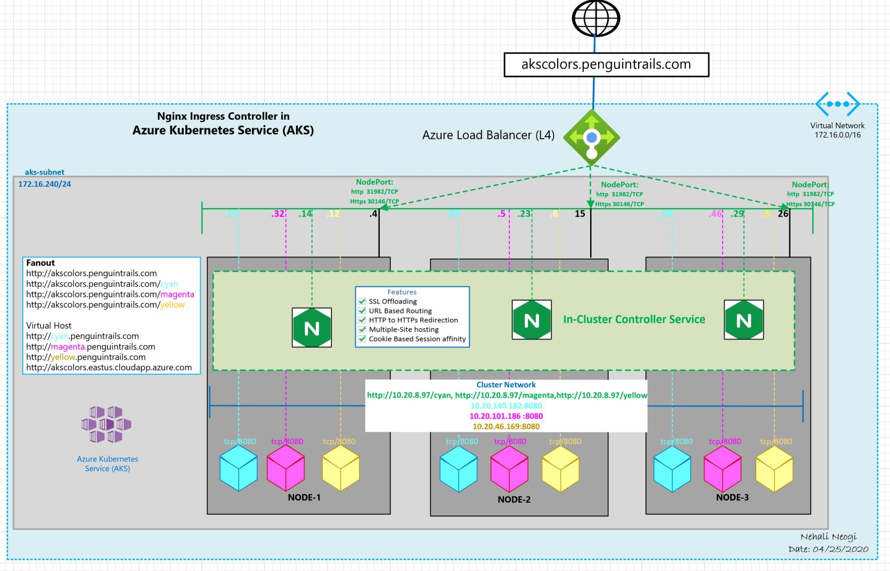

# aks-nginx-ingress
AKS with nginx ingress controller
# Application Gateway as Ingress Controller with Azure Kubernetes Service
#
# Blog link
#
https://nehalineogi.blogspot.com/
#
# Architecture Diagram

#
# Test Drive
Fanout
* http://akscolors.penguintrails.com   (default)
* http://akscolors.penguintrails.com/cyan
* http://akscolors.penguintrails.com/magenta
* http://akscolors.penguintrails.com/yellow

Virtual Host
* http://cyan.penguintrails.com
* http://magenta.penguintrails.com
* http://yellow.penguintrails.com


# Howto

# Create Namespace
```
kubectl create namespace colors-ns
```
# Create Deployments
```
kubectl apply -f red-deployment.yaml
kubectl apply -f green-deployment.yaml
kubectl apply -f blue-deployment.yaml
kubectl apply -f white-deployment.yaml

#
```
#
# Ingress
#
```
kubectl apply -f colors-fanout.yaml
kubectl apply -f colors-virtual-host.yaml
```
